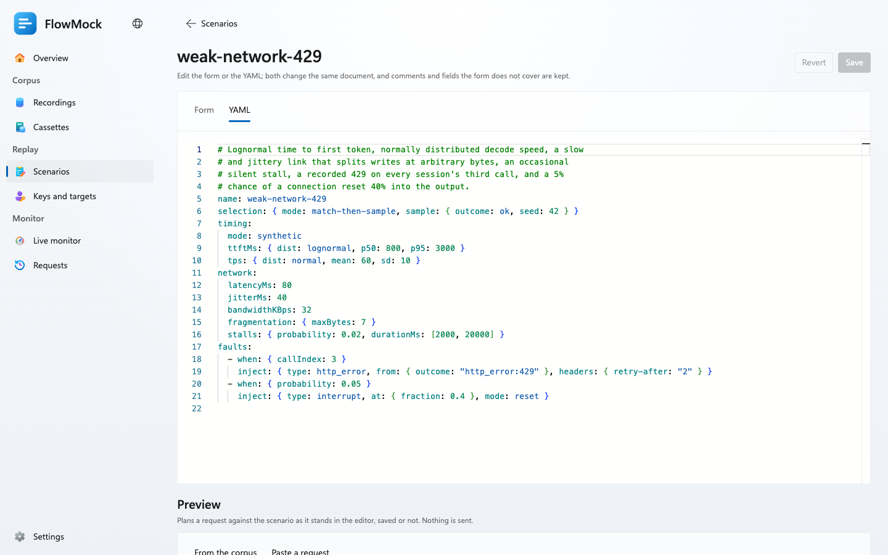
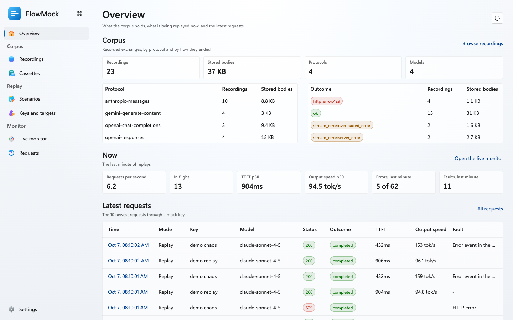
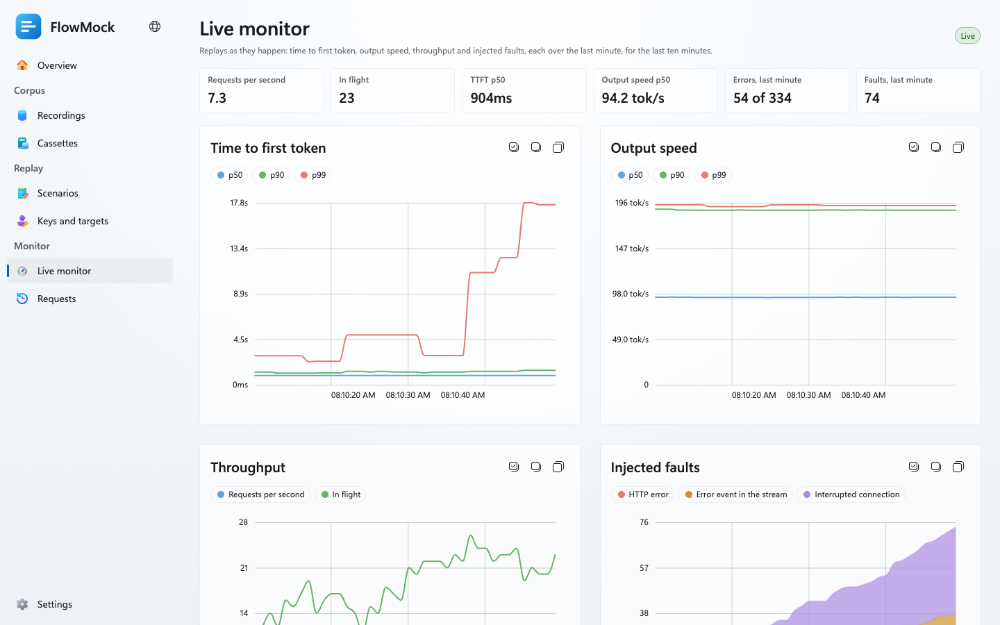
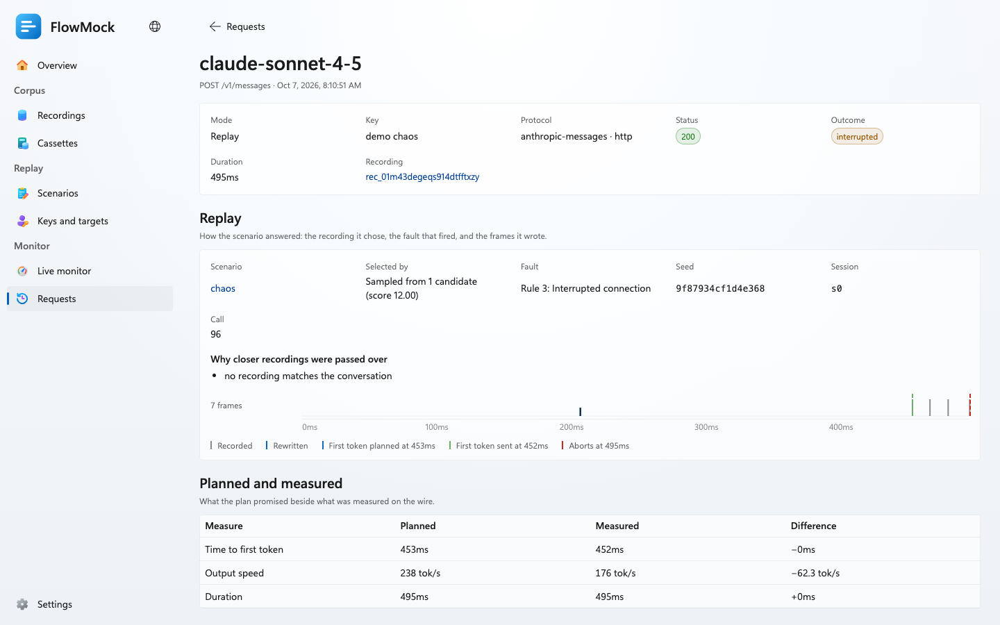

# FlowMock

English | [简体中文](README_CN.md)

FlowMock is a record-and-replay simulator for LLM APIs. It records real model
traffic through a proxy, then plays it back with the timing, network conditions
and failures a scenario describes, so clients and coding agents can be tested
against realistic and hostile upstreams without spending a token.



## Highlights

- Record and replay Anthropic Messages, OpenAI Chat Completions, OpenAI
  Responses over HTTP and WebSocket, and Gemini, keeping the upstream's bytes.
- Answer each request with the recording of the same conversation, the longest
  shared prefix, the next step of a recorded session, or a seeded sample.
- Replay recorded timing as it was or scaled, or draw it from time-to-first-token
  and output-speed distributions.
- Degrade the link with latency, jitter, silent stalls, a bandwidth cap, and
  fragmentation that splits UTF-8 characters and SSE lines.
- Inject recorded 429s and stream errors, an early FIN, an abort, a TCP reset,
  a hang or a WebSocket close, by call number, every N calls, probability or
  time window.
- Re-run any replay exactly: every random choice derives from `x-flowmock-seed`.
- Manage recordings, scenarios, keys, live metrics and per-request traces from
  a management app in English or Simplified Chinese.

## Quick Start

Requires Node.js 22.19 or later and pnpm 10.

```bash
git clone https://github.com/chen-ran/flowmock.git
cd flowmock
pnpm install
pnpm run build:web
pnpm start -- --config examples/flowmock.yaml
```

Open <http://127.0.0.1:8787>. The example configuration imports a small demo
corpus and binds four mock keys, so FlowMock works without any upstream access:

| Key | Scenario | Behavior |
|---|---|---|
| `fm-demo-replay` | `default` | Replays recordings as recorded |
| `fm-demo-weak-network` | `weak-network-429` | A slow, jittery, fragmented link with stalls, and a 429 on every session's third call |
| `fm-demo-slow-reasoning` | `slow-reasoning` | A long time to first token and a modest output speed |
| `fm-demo-chaos` | `chaos` | 529s, stream errors, aborts and hangs in rotation |

Then:

1. Send a request through one of the keys:

   ```bash
   curl -N http://127.0.0.1:8787/v1/messages \
     -H 'x-api-key: fm-demo-weak-network' -H 'content-type: application/json' \
     -d '{"model":"claude-sonnet-4-5","max_tokens":256,"stream":true,"messages":[{"role":"user","content":"Say hello"}]}'
   ```

2. Watch it under **Requests** and **Live monitor**.
3. Open a scenario under **Scenarios**, change it, and preview what it would
   do to any recorded request before you save it.

## Connecting Clients

A client keeps its SDK and changes only its base URL and API key:

| API | Base URL | Credential |
|---|---|---|
| Anthropic Messages | `http://127.0.0.1:8787` | `x-api-key` or `Authorization: Bearer` |
| OpenAI Chat Completions and Responses | `http://127.0.0.1:8787/v1` | `Authorization: Bearer` |
| OpenAI Responses over WebSocket | `ws://127.0.0.1:8787/v1/responses` | `Authorization: Bearer` |
| Gemini | `http://127.0.0.1:8787` | `x-goog-api-key` or `?key=` |

```bash
ANTHROPIC_BASE_URL=http://127.0.0.1:8787 ANTHROPIC_API_KEY=fm-demo-replay claude
```

**Keys and targets → Client configuration** writes the same for the Anthropic,
OpenAI and Google GenAI SDKs, curl, Claude Code and Codex.

## Record, Replay, Break

**Record.** Give FlowMock an upstream and bind a key to it. Requests go through
unchanged, stream back as they arrive, and are stored with the arrival time of
every chunk, one cassette per client session:

```yaml
# flowmock.yaml
targets:
  - id: anthropic
    baseUrl: https://api.anthropic.com
    headers: { x-api-key: "${ANTHROPIC_API_KEY}" }
keys:
  - { key: fm-record-anthropic, record: anthropic }
  - { key: fm-replay-anthropic, replay: weak-network-429 }
```

**Replay.** Switch the client to a key bound to a scenario. Nothing else in its
configuration changes.

**Break.** A scenario says how a replay is selected, timed, carried and failed:

```yaml
name: weak-network-429
selection: { mode: match-then-sample, sample: { outcome: ok, seed: 42 } }
timing:
  mode: synthetic
  ttftMs: { dist: lognormal, p50: 800, p95: 3000 }
  tps: { dist: normal, mean: 60, sd: 10 }
network:
  latencyMs: 80
  jitterMs: 40
  bandwidthKBps: 32
  fragmentation: { maxBytes: 7 }
  stalls: { probability: 0.02, durationMs: [2000, 20000] }
faults:
  - when: { callIndex: 3 }
    inject: { type: http_error, from: { outcome: "http_error:429" }, headers: { retry-after: "2" } }
  - when: { probability: 0.05 }
    inject: { type: interrupt, at: { fraction: 0.4 }, mode: reset }
```

Error bodies and stream errors come from recordings or from the scenario
itself, never invented. The scenarios under
[`examples/scenarios`](examples/scenarios) are a starting point. A request
can pick another scenario with `x-flowmock-scenario`, name its session with
`x-flowmock-session`, or ask for `"model": "<model>@<scenario>"` when it cannot
send headers.

## Management App

The app at `/` covers everything the admin API does and follows the system's
light or dark scheme. It asks for `FLOWMOCK_ADMIN_KEY` once when one is set.

| | |
|---|---|
|  |  |



## Configuration

| Flag | Environment | Default | Meaning |
|---|---|---|---|
| `--host` | `FLOWMOCK_HOST` | `127.0.0.1` | Interface to listen on |
| `--port` | `FLOWMOCK_PORT` | `8787` | Port |
| `--data` | `FLOWMOCK_DATA_DIR` | `./data` | SQLite database and recorded chunks |
| `--config` | `FLOWMOCK_CONFIG` | none | `flowmock.yaml` applied at startup |
| | `FLOWMOCK_ADMIN_KEY` | none | Protects `/api` and `/metrics`; required beyond loopback |

`flowmock.yaml` holds targets, keys, scenarios and corpus files to import; see
[`examples/flowmock.yaml`](examples/flowmock.yaml). The scenario format, the
admin API, Prometheus metrics, storage and known limitations are in the
[reference](docs/reference.md).

## Development

```bash
pnpm install
pnpm start -- --config examples/flowmock.yaml   # the server
pnpm run dev:web                                # the app, on port 5175
pnpm run verify
```

`verify` runs lint, typecheck, every test, and the web build with its bundle
checks; CI runs exactly that. Integration tests bind real sockets and drive
FlowMock with the official Anthropic, OpenAI and Google GenAI SDKs.
[AGENTS.md](AGENTS.md) defines the repository rules and indexes its packages.

## License

MIT

## A Sister Project of Floway

FlowMock is a sister project of [Floway](https://github.com/Menci/Floway), the
self-hosted LLM API gateway for coding agents and API clients. Floway carries
your agents' traffic to real models; FlowMock records that traffic and plays it
back, on your terms, whenever you test. The two share a WinUI-styled interface,
and parts of FlowMock are ported from Floway; see [NOTICE.md](NOTICE.md).
